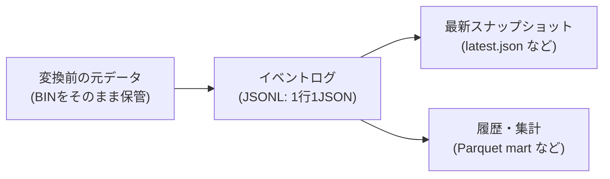

この章では、`agyancast` の設計要件と、それを満たすために最初に固めた方針を整理します。

このプロジェクトの狙いは“高精度なモデル”ではなく、**GTFS-RTを継続的に取得して、履歴として後から使える状態にすること**です。
そのために、データの置き場所（S3のキー設計）と責務分離（どこで何をするか）を先に決めました。

## 先に結論: データを3つに分ける

GTFS-RTを運用で回そうとすると、最初から「最終形の集計テーブル」を作るのはだいたい無理が出ます。
理由は単純で、仕様と実データに差分があり、運用しながら解釈が更新されるからです。

そこで `agyancast` では、次の3つを分けました。

1. **変換前の元データ**（取得したBINをそのまま保存する）
2. **イベントログ**（必要項目を抜き出し、1観測=1レコードでためる）
3. **データプロダクト**（画面向けの最新スナップショット、分析向けの集計を分けて出す）

データ基盤の世界では、この分け方を「メダリオンアーキテクチャ（Raw/Bronze/Silver…）」と呼ぶことが多いです。
本書でも便宜上この言葉を使いますが、用語より先に「何のために分けるのか」を優先します。

以降、この本では便宜上つぎの呼び方も併記します。

- 変換前の元データ = `Raw`
- イベントログ = `Bronze`
- データプロダクト = `Silver`

実装上の置き場所（S3のキー）は、だいたい次のイメージです。

- Raw: `raw/company=.../dt=YYYY-MM-DD/hour=HH/minute=mm/*.bin`
- Bronze: `bronze/dt=YYYY-MM-DD/hour=HH/part-YYYY-MM-DD-HHmm.jsonl`
- Silver（データ用バケット）: `silver/latest.json`, `silver/state/last_stop_delay.json`, `silver/mart/daily_delay/dt=YYYY-MM-DD/part-YYYY-MM-DD.parquet`
- Web配信用バケット: `data/latest.json`, `data/daily_delay.json`, `data/places.json`

## 原則1: 変換前の元データ（Raw）を必ず残す

リアルタイムデータ処理は、最初の実装で100%正解にするのが難しいです。
そのため、**取得したBINをパースせず、そのまま保管**します。

これをやる理由は3つあります。

- 変換ロジックを後から直せる（仕様理解が深まった後にやり直せる）
- 誤判定時に再計算できる（「いつから壊れたか」を検証できる）
- 再取得できない期間が出ても復旧できる（外部都合の欠損に強い）

実装は `infra/lambda/ingest.ts` で、S3に次のような形で保存しています。

- `raw/company=.../dt=YYYY-MM-DD/hour=HH/minute=mm/*.bin`

この「`dt/hour/minute` をキーにした階層」は、後でAthena等で扱うときにも効きます（後章で説明します）。

## 原則2: 欠損は“例外”ではなく“前提”として設計する

GTFS-RTは実運用データなので、次が普通に起きます。

- 一部フィールドの欠損
- 一時的な取得失敗
- 停留所ごとのデータばらつき

ここで重要なのは「欠損しない前提」を捨てることです。
欠損があると、画面は急に `unknown` だらけになり、利用者の信頼を失いやすいからです。

`agyancast` では、欠損に対して次の方針を取りました。

- 欠損しても“壊れない”データ形（後述のイベントログ）でためる
- 画面のために、直近値での補完を入れる（ただし期限つき）

補完ルールのキーは `(company, stop_id)`、直近値補完の有効期限は**3時間**です。

補完に使う直近値は `silver/state/last_stop_delay.json` に保持しています（`infra/lambda/transform.ts`）。

## 原則3: 「使う項目」を明示的に絞る（まず最小セットで成立させる）

GTFS/GTFS-RTは情報量が多いため、MVPでは使う項目を明示しました。

今回の混雑代理指標は、基本的にこの2つだけで成立します。

- `stop_id`（どの停留所の観測か）
- `delay`（予定との差分秒）

そして「停留所の遅延」を「商業施設周辺の混雑」に翻訳するために、`spots.csv` を使います。
`spots.csv` は `(company, stop_id)` をキーに「どの停留所がどのモールに紐づくか」を定義するマスタです。

集約は“平均”ではなく**中央値**を採用しました。
便によって外れ値が出やすく、平均だと表示がブレやすいからです（詳しくは後章）。

「今使わないフィールド」を決めると、実装が安定します。

## 原則4: 画面都合と分析都合を分ける（同じデータでも“責務”が違う）

同じデータでも用途が違うため、出力を分けています。

- 画面向け: `latest.json` のような軽量なスナップショット（すぐ読めることが大事）
- 分析向け: `mart/daily_delay` のようなParquet（クエリしやすいことが大事）

これでフロントと分析の変更が衝突しにくくなります。

## 原則5: 予測は“最後に載せる”（その前に“再処理できる土台”が必要）

予測は魅力的ですが、基盤が弱い状態で載せると保守不能になります。

順番は次です。

1. 取得
2. 保存（元データ保管）
3. 変換（イベントログ化・スナップショット化）
4. 履歴蓄積（集計・比較できる形にする）
5. 予測

この順番が、今回の最重要判断でした。

## 補足: なぜ“10分おき”で回しているのか

今回のGTFS-RTは約15秒で更新されますが、`agyancast` の取得・変換は10分おきにしています。

一番の理由は、提供元に余計な負担をかけないためです。個人開発が15秒おきに取りに行くと、相手側の帯域や負荷を食いがちなので、まずは控えめに回します。

加えて、次の理由もあります。

- 15秒おきに取ると保存量が一気に増える（S3、監視、リトライ、欠損処理が重くなる）
- MVPの目的は“秒単位の完全リアルタイム”ではなく、傾向を見て体験を成立させること
- 必要になったら間隔は詰められる（まずは設計とパイプラインを固める）

## まとめ

この章のメッセージはシンプルです。

- **変換前の元データを残す**
- **イベントログにして、あとから使える形でためる**
- **画面用と分析用を分ける**

次章からは、そもそもGTFS/GTFS-RTがどういうデータで、どの項目をどう読むべきかを整理します。
