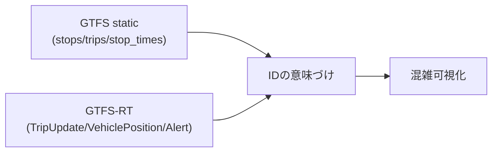

## GTFSには大きく2種類ある

このプロジェクトで使うGTFS系データは2種類です。

1. GTFS static（静的）
2. GTFS-RT（リアルタイム）

### GTFS static

- 配布形式: zip（中身はCSV相当の `.txt`）
- 役割: 予定情報（停留所、路線、時刻表）

### GTFS-RT

- 配布形式: `.bin`（Protocol Buffers）
- 役割: 実績/予測のリアルタイム情報（遅延、車両位置、運行障害）

## この2つがどう噛み合うか

GTFS-RTだけではIDの意味が薄く、GTFS staticだけでは現在状況が見えません。
両方を接続してはじめて価値が出ます。

## 今回の仕様で実際に使う範囲

### static側

- `stops.txt`: `stop_id`, `stop_name`, `stop_lat`, `stop_lon`
- `trips.txt`: `trip_id`, `route_id`
- `stop_times.txt`: `trip_id`, `stop_id`, `stop_sequence`, `arrival_time`, `departure_time`

### realtime側

- `FeedHeader.timestamp`
- `TripUpdate.trip.tripId`
- `TripUpdate.trip.routeId`
- `TripUpdate.stopTimeUpdate[].stopId`
- `TripUpdate.stopTimeUpdate[].arrival.delay`
- `TripUpdate.stopTimeUpdate[].departure.delay`
- `TripUpdate.timestamp`

## ここでの実務上のポイント

今回のMVPは「使うフィールドを狭く固定」したのがポイントです。

- 仕様を広く読みすぎて実装を重くしない
- まずは安定運用できる最小セットで成立させる
- 後でフィールド追加できる構造にしておく

次章で、GTFS staticのファイル関係を実データで確認します。
