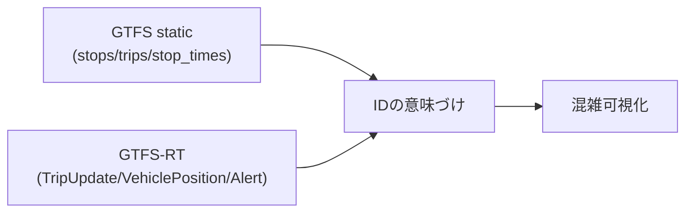

GTFS/GTFS-RTは情報量が多いので、最初に全体像をつかんだ方が楽です。
この章では、仕様書を上から読むのではなく、「システムに落とすときの見取り図」として整理します。

まずは **Static（基準）** と **Realtime（変化）** の2つに分かれる、というところだけ押さえます。

## GTFSには大きく2種類ある

このプロジェクトで使うGTFS系データは2種類です。

1. GTFS static（静的）
2. GTFS-RT（リアルタイム）

## GTFS static（静的）: 「基準となる世界」

GTFS static は、停留所・路線・時刻表などの“基準情報（予定）”です。
配布形式は、だいたい次の形です。

- 配布形式: zip（中身はCSV相当の `.txt` ファイル群）
- 役割: 予定情報（停留所、路線、時刻表、運行日、運賃など）

GTFS static は「予定」なので、単体では“いま遅れているか”は分かりません。
その代わり、GTFS-RTが返してくる `stop_id` や `trip_id` を「地名・便名」に引き直すための辞書になります。

## GTFS-RT（Realtime）: 「いま起きている変化」

- 配布形式: `.bin`（Protocol Buffers）
- 役割: 実績/予測のリアルタイム情報（遅延、車両位置、運行障害 など）

GTFS-RT には代表的に3種類の“更新データ”があります（1つのバイナリの中に混ざっているというより、別フィードで配られることが多いです）。

- `TripUpdate`（便・停留所ごとの遅延など）
- `VehiclePosition`（車両の現在位置など）
- `Alert`（運休・迂回・お知らせなど）

`agyancast` の混雑代理指標の中心は `TripUpdate`（遅延）です。

## この2つがどう噛み合うか

GTFS-RTだけではIDの意味が薄く、GTFS staticだけでは現在状況が見えません。
両方を接続してはじめて価値が出ます。

ここで言いたいのは、**GTFS-RTはGTFS staticのIDを参照している**ということです。

- `stop_id`: どの停留所か（staticの `stops.txt` で名前や緯度経度が引ける）
- `trip_id`: どの便か（staticの `trips.txt` や `stop_times.txt` と結べる）
- `route_id`: どの路線か（staticの `routes.txt` と結べる）

「IDが結べる」状態になると、GTFS-RTの遅延が「地図上のどこで起きているか」に変換できます。

## この本で扱うデータソース

`agyancast` では、Bus-Vision（熊本オープンデータ）で公開されているGTFS/GTFS-RTを使います。
エンドポイント一覧は `agyancast_spec.md` にまとめています。

## 今回の仕様で実際に使う範囲

この本では、仕様を全部説明するのではなく、
`agyancast` のMVPで必要だった範囲に絞って丁寧に説明します。

### static側（主にIDの辞書）

- `stops.txt`: `stop_id`, `stop_name`, `stop_lat`, `stop_lon`
- `routes.txt`: `route_id`, `route_short_name`, `route_long_name`（路線の表示用）
- `trips.txt`: `trip_id`, `route_id`, `service_id`（便と路線の関係）
- `stop_times.txt`: `trip_id`, `stop_id`, `stop_sequence`, `arrival_time`, `departure_time`（便の停留所列）
- `calendar.txt` / `calendar_dates.txt`: `service_id`（運行日の定義）

### realtime側（主に遅延の観測）

- `FeedHeader.timestamp`
- `TripUpdate.trip.tripId`
- `TripUpdate.trip.routeId`
- `TripUpdate.stopTimeUpdate[].stopId`
- `TripUpdate.stopTimeUpdate[].arrival.delay`
- `TripUpdate.stopTimeUpdate[].departure.delay`
- `TripUpdate.timestamp`

## ここでの実務上のポイント

今回のMVPは「使うフィールドを狭く固定」したのが効きました。

- 仕様を広く読みすぎて実装を重くしない
- まずは安定運用できる最小セットで成立させる
- 後でフィールド追加できる構造にしておく

次章では、GTFS static（zip内の `.txt` ファイル群）を「どのファイルのどの列を使うのか」という観点で整理します。
