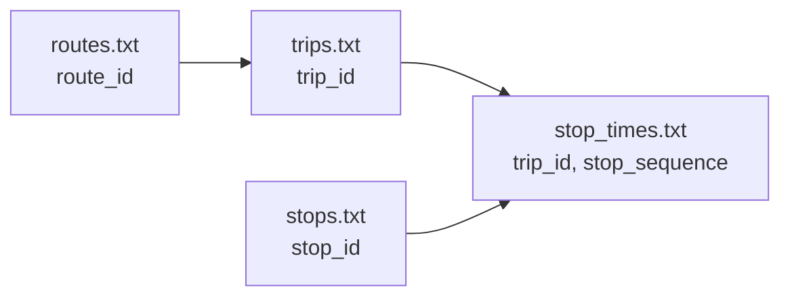

この章では、仕様の用語だけでなく、実ファイルを見ながら理解します。

参照するファイル:

- `/Users/nakamurashinnosuke/Documents/GitHub/agyancast/GTFS/kumabus/stops.txt`
- `/Users/nakamurashinnosuke/Documents/GitHub/agyancast/GTFS/kumabus/trips.txt`
- `/Users/nakamurashinnosuke/Documents/GitHub/agyancast/GTFS/kumabus/stop_times.txt`

## 1. stops.txt（停留所マスタ）

`stops.txt` には、停留所ID・名称・緯度経度が入ります。

```csv
"stop_id","stop_name","stop_lat","stop_lon"
"100002_1","桜町バスターミナル","32.800438","130.70398"
```

ポイント:

- `stop_id` は他ファイルから参照される重要キー
- 表示名は `stop_name`
- 地図表示には `stop_lat` / `stop_lon`

## 2. trips.txt（便の定義）

`trips.txt` は「どの路線の、どの便か」を表します。

```csv
"route_id","service_id","trip_id","trip_headsign"
"1_1313_2_20260109","1_1_20260109","1_1118_20260109","通潤山荘"
```

ポイント:

- `trip_id` は1運行単位のキー
- `route_id` で路線に紐づく
- `service_id` で運行日パターンに紐づく

## 3. stop_times.txt（便の時系列）

`stop_times.txt` は、tripごとの停車順と時刻を持ちます。

```csv
"trip_id","arrival_time","departure_time","stop_id","stop_sequence"
"11_1_20260109","06:28:00","06:28:00","100002_1","1"
"11_1_20260109","06:31:00","06:31:00","100005_2","2"
```

ポイント:

- `trip_id` + `stop_sequence` で、便の中の1点が定まる
- `stop_id` が `stops.txt` に接続する
- 予定時刻との差分を考えるときの基準になる

## 4. ファイル関係を図で整理



## 5. Required / Conditionally Required の考え方

GTFS仕様では「必須」「条件付き必須」が明確です。

例:

- `calendar.txt` は、すべてを `calendar_dates.txt` で表現しない限り必要
- `calendar_dates.txt` は `calendar.txt` を省略するなら全運行日を持つ必要

このあたりは仕様に厳密に従うと、後でパーサ実装が安定します。

## 6. このプロジェクトでの実務上の使い方

`agyancast` では最初のMVP段階で、静的GTFSは次に絞って利用しています。

- `stop_id` の意味づけ（どの停留所か）
- `trip_id` / `route_id` の補助情報
- モール停留所定義 `spots.csv` の整備

次章で、リアルタイム版のGTFS-RTに進みます。
