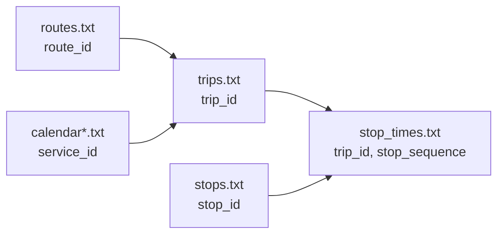

この章では、GTFS static（静的データ）を「後でGTFS-RTと結びつけて使う」前提で整理します。

GTFS static を全部暗記する必要はありません。
実装で困るのは、だいたい次の3つです。

1. どのファイルが“何の辞書”なのか分からない
2. どのIDでGTFS-RTと結べばいいのか迷う
3. どこまで読めばMVPが動くのか判断できない

この章では、`agyancast` のMVPで必要だった範囲に絞って、ファイルとIDのつながりを押さえます。

参照（本章では `kumabus` を例にしますが、他の事業者も基本は同じです）:

- `GTFS/kumabus/stops.txt`
- `GTFS/kumabus/routes.txt`
- `GTFS/kumabus/trips.txt`
- `GTFS/kumabus/stop_times.txt`
- `GTFS/kumabus/calendar.txt`
- `GTFS/kumabus/calendar_dates.txt`

## 0. GTFS staticは「ファイルの集合」

GTFS static は、1つの巨大なCSVではなく、複数ファイルの集合です。
全部を使う必要はありませんが、つながりを知っておくと実装が一気に楽になります。

代表的なファイル（抜粋）:

- `stops.txt`: 停留所の辞書（名前・緯度経度）
- `routes.txt`: 路線の辞書（表示名など）
- `trips.txt`: 便の辞書（どの路線・どの運行日に属するか）
- `stop_times.txt`: 便の停留所列（順序・予定時刻）
- `calendar.txt` / `calendar_dates.txt`: 運行日（曜日パターンと例外）

事業者が複数ある場合、**IDは事業者ごとに閉じている**ことが多いです。
そのため `agyancast` では `company`（事業者）を必ず持ち回り、`company + stop_id` のように“名前空間”を作っています。

## 1. ファイル関係（IDのつながり）



## 2. stops.txt（停留所の辞書）

例:

```csv
"stop_id","stop_name","stop_lat","stop_lon"
"100002_1","桜町バスターミナル","32.800438","130.70398"
```

今回の用途:

- `stop_id`: GTFS-RTとの突合キー
- `stop_name`: UI表示名
- `stop_lat`, `stop_lon`: 地図描画

補足:

- `stop_id` は「停留所を一意に表すID」です。GTFS-RT側もこのIDで“どこで起きた遅延か”を表します。
- `stop_code` が別に入っていることもありますが、**GTFS-RTで使われるのは stop_id** がほとんどです（データ提供者次第）。
- `location_type` / `parent_station` がある場合、駅の中の複数の乗り場をまとめたいときに使えます（MVPでは未使用）。

## 3. routes.txt（路線の辞書）

例:

```csv
"route_id","agency_id","route_short_name","route_long_name","route_type"
"1_1313_2_20260109","9330001001600","","M3-2：桜町バスターミナル→田迎→イオン→通潤山荘","3"
```

今回の用途:

- `route_id`: GTFS-RTの `TripUpdate.trip.routeId` の意味づけ（路線名や系統）
- 生活シーン別ビュー（来訪/通勤など）の“フィルタ”に使える

MVPでは `route_long_name` を画面に出すところまではやっていませんが、
後で説明可能性を上げるときに効きます（「どの路線の遅れが効いているのか」）。

## 4. trips.txt（便の辞書）

例:

```csv
"route_id","service_id","trip_id","trip_headsign"
"1_1313_2_20260109","1_1_20260109","1_1118_20260109","通潤山荘"
```

ここでの理解のコツ:

- `route_id` は「路線」単位（だいたい人間が認識する“系統”）
- `trip_id` は「便」単位（同じ路線でも出発時刻が違えば別trip）
- `service_id` は「運行日パターン」単位（平日ダイヤ・土日ダイヤなど）

`agyancast` の混雑判定は stop_id + delay が主ですが、`trip_id` / `route_id` を持っておくと将来の拡張が楽になります。

## 5. stop_times.txt（便の停留所列と予定時刻）

例:

```csv
"trip_id","arrival_time","departure_time","stop_id","stop_sequence"
"11_1_20260109","06:28:00","06:28:00","100002_1","1"
```

今回の用途:

- 区間移動時間の理論値確認（予定時刻どうしの差分）
- `stop_sequence` の順序整合
- 将来の区間所要時間指標化の土台

GTFSでよくある落とし穴:

- `arrival_time` / `departure_time` が `25:10:00` のように24時を超えることがある（深夜便を“同一サービス日”として表現するため）
- `stop_sequence` は数値として扱う（文字列としてソートすると事故る）
- 便の停留所列を扱うときは、`trip_id` で絞って `stop_sequence` で並べる

## 6. calendar.txt / calendar_dates.txt（運行日）

GTFS static では、「この `trip_id` が今日走るのか？」は `service_id` を介して決まります。

```text
trips.txt: trip_id -> service_id
calendar*.txt: service_id -> 曜日パターン / 例外日
```

MVPで“混雑の気配”を見るだけなら、運行日判定を厳密にやらなくても成立します。
一方で「曜日平均との差」「祝日効果」などに進むとき、ここが重要になります。

## 7. `spots.csv` を間に挟む

本プロジェクトは「モール単位可視化」が目的なので、全停留所をそのまま集計しません。
`spots.csv` で、対象停留所を明示的に絞ります。

- 参照: `spots.csv`
- キー: `(company, stop_id)`

この1段を入れることで、交通データ（stop_idの世界）とプロダクト要件（モールの世界）が接続されます。

## 8. static側で今回使っていないもの（ただし将来使える）

MVPでは次は未使用または最小利用です。

- fare関連（運賃）
- shapesの詳細利用（経路形状）
- calendarの高度な例外処理（休日・臨時便の精密化）

ただし将来、所要時間や予測に進むときに再利用できるため、データ自体は保持しておくのが安全です。

次章では、GTFS-RT（protobufのBIN）の中身を見て、「なぜ元データ保管（Raw）が効くのか」を具体的に押さえます。
