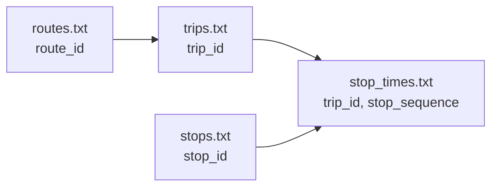

この章では、`agyancast` の実データに沿って static フォーマットを具体化します。

参照:

- `GTFS/kumabus/stops.txt`
- `GTFS/kumabus/trips.txt`
- `GTFS/kumabus/stop_times.txt`

## 1. ファイル関係



## 2. stops.txt

例:

```csv
"stop_id","stop_name","stop_lat","stop_lon"
"100002_1","桜町バスターミナル","32.800438","130.70398"
```

今回の用途:

- `stop_id`: GTFS-RTとの突合キー
- `stop_name`: UI表示名
- `stop_lat`, `stop_lon`: 地図描画

## 3. trips.txt

例:

```csv
"route_id","service_id","trip_id","trip_headsign"
"1_1313_2_20260109","1_1_20260109","1_1118_20260109","通潤山荘"
```

今回の用途:

- `trip_id`: GTFS-RT TripUpdateの文脈解釈
- `route_id`: 空港系・通勤系などのルート判定に利用

## 4. stop_times.txt

例:

```csv
"trip_id","arrival_time","departure_time","stop_id","stop_sequence"
"11_1_20260109","06:28:00","06:28:00","100002_1","1"
```

今回の用途:

- 区間移動時間の理論値確認
- `stop_sequence` の順序整合
- 将来の区間所要時間指標化の土台

## 5. 実装上はspots.csvを間に挟む

本プロジェクトは「モール単位可視化」が目的なので、全停留所をそのまま集計しません。

`spots.csv` で、対象停留所を明示的に絞ります。

- 参照: `spots.csv`
- キー: `(company, stop_id)`

この1段を入れることで、仕様理解とプロダクト要件が接続されます。

## 6. static側で今回使っていないもの

MVPでは次は未使用または最小利用です。

- fare関連
- shapesの詳細利用
- calendarの高度な例外処理

ただし将来予測では再利用可能なので、データ自体は保持します。
