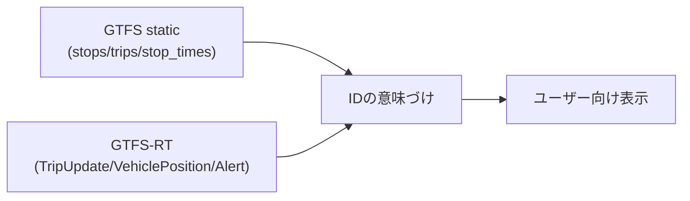

## GTFS-RTを一言でいうと

GTFS-RTは、GTFS（静的時刻表）を補うリアルタイム拡張です。

- 遅延（TripUpdate）
- 車両位置（VehiclePosition）
- 運行障害情報（Alert）

公式仕様:

- [https://gtfs.org/documentation/realtime/reference/](https://gtfs.org/documentation/realtime/reference/)

## データ形式はProtocol Buffers

GTFS-RTの実体は、CSVではなくProtocol Buffers（バイナリ）です。

- 例: `*_trip_update.bin`
- 小さく高速に送受信できる
- デコードには定義ファイルに対応したライブラリが必要

## メッセージ構造の最小理解

GTFS-RTは次の入れ子を理解すれば読めます。

```text
FeedMessage
  ├─ FeedHeader
  └─ FeedEntity[]
       ├─ trip_update (TripUpdate)
       ├─ vehicle (VehiclePosition)
       └─ alert (Alert)
```

重要点:

- `FeedHeader.timestamp` は「このフィードが作られた時刻」
- `FeedEntity` は1件ずつのリアルタイム情報
- 実装では `entity.tripUpdate` があるかをまず判定する

## GTFSとGTFS-RTの関係

GTFS-RTは単独では意味が薄いです。`trip_id` や `stop_id` の意味は静的GTFS側にあります。



## 本プロジェクトで使っているフィード

`agyancast` では熊本4社ぶんを取得しています（TripUpdate/VehiclePosition/Alert）。

- 産交バス
- 熊本電鉄バス
- 熊本バス
- 熊本都市バス

実エンドポイント一覧は `agyancast_spec.md` の「3. GTFS-RT エンドポイント一覧」を参照。

次章で、今回のMVPで中核になるTripUpdateを深掘りします。
