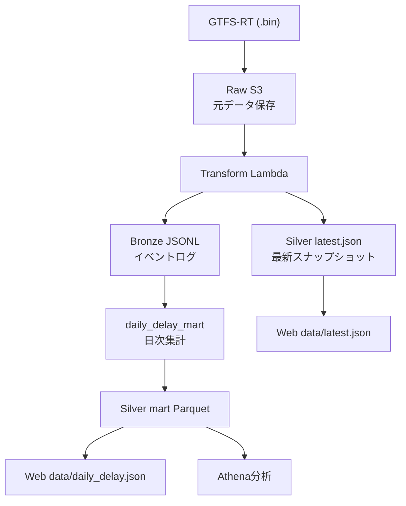

この章では、データレイヤー設計を説明します。

## 全体像



## 1. Raw: 不変の事実を残す層

- 取得した `.bin` をそのまま保存
- 後から再パースできる
- 「変換ミス時に復旧できる保険」

保存例:

```text
s3://<bucket>/raw/company=.../dt=YYYY-MM-DD/hour=HH/minute=MM/*.bin
```

## 2. Bronze: 構造化イベントログ

- 1イベント1レコードのJSONL
- 重複は許容
- まずは壊れにくさを優先

保存例:

```text
s3://<bucket>/bronze/dt=YYYY-MM-DD/hour=HH/part-*.jsonl
```

## 3. Silver: 使うための形

`latest.json` はUI即応用、`mart` は分析用です。

- `latest.json`: 今の状態
- `latest_detail.json`: 詳細（サンプル数、補完数など）
- `daily_delay` Parquet: 時系列集計

## 4. なぜ分けるか

1つのテーブルに全部押し込むと、変更時の影響が大きくなります。

レイヤー分離により、次が可能になります。

- 取り込みロジック変更とUI変更を独立
- 解析ロジックの改善を後から適用
- 保存コストとクエリコストの最適化

## 5. この設計で重要な判断

- イベント時刻はGTFS-RT timestamp優先
- JSTで集計パーティションを切る
- 欠損を許容し、補完ルールを明示する

これで「綺麗なデータしか扱えない」設計を避けています。
