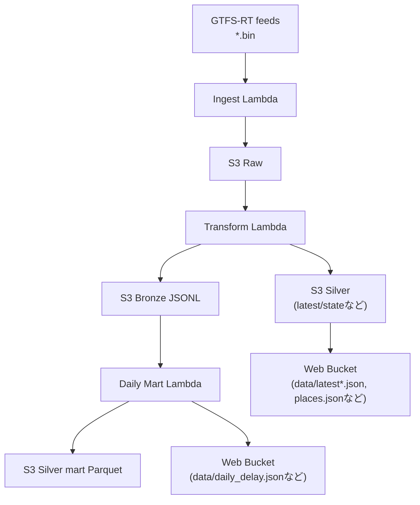

ここでは、GTFS-RTを「システムとして動かす」ための全体フローを、AWS上の構成に落とし込みます。
ポイントは次の3つです。

1. どのタイミングで何をするか（責務分離）
2. S3に何をどう置くか（Raw/Bronze/Silver）
3. Web配信と分析をどう分けるか

## 全体フロー（まず俯瞰）

このプロジェクトは「S3を中心に据えたシンプルなデータレイク」です。
Raw（元データ）、Bronze（イベントログ）、Silver（データプロダクト）をS3に置き、Lambdaで作っていきます。

## 1. Ingest（収集）: 取って、そのまま残す

- 役割: 外部フィード取得とRaw保存
- 実装: `infra/lambda/ingest.ts`
- 重要: **ここでは変換しない（失敗しにくくする）**

`ingest.ts` は、GTFS-RTの複数エンドポイント（4事業者×3種）を取得して、S3に保存します。
保存先は次のような形です。

- `raw/company=.../dt=YYYY-MM-DD/hour=HH/minute=mm/*.bin`

Rawを「変換前の元データ」として残すことで、変換ロジックが変わっても再処理できます。

## 2. Transform（変換）

- 役割: BINデコード、遅延抽出、ステータス化、イベントログ化
- 実装: `infra/lambda/transform.ts`

出力:

- Bronze: JSONL（イベントログ）
- Silver: 最新スナップショット / 状態ファイル
- Web向け: `data/latest*.json`, `data/places.json` など

transformは「生データを、運用に耐える形へ翻訳する」層です。

やっていること（要点だけ）:

1. 会社ごとに最新の `trip_update.bin` を探して読む
2. protobufをデコードして、`stop_id` と `delay` を抜き出す
3. `(company, stop_id)` をキーに、モール単位へ集約する（中央値）
4. `latest.json` / `latest_detail.json` を作る
5. Bronze（JSONL）を出力する

欠損に備えた直近値補完のために、`silver/state/last_stop_delay.json` も更新します。

## 3. Daily mart（集計）: 履歴を“使える形”にする

- 役割: 日次時系列の作成
- 実装: `infra/lambda_py/daily_delay_mart/handler.py`

出力:

- `silver/mart/daily_delay/dt=.../*.parquet`
- `web/data/daily_delay.json`（Web配信用の軽量JSON）

Daily mart は Bronze（イベントログ）を読んで、日次の集計結果を作ります。

- Web向けには、24時間の配列にした `daily_delay.json` を出す（フロントが読みやすい）
- 分析向けには、ParquetにしてS3に置く（Athena等で扱いやすい）

## 4. スケジュール

CDKではEventBridgeで10分おき実行（JST 05:00〜23:50）です。

- 参照: `infra/lib/agyancast-data-stack.ts`

補足:

- EventBridgeのcronはUTC評価なので、JSTに合わせるにはUTCの時刻範囲に変換が必要です
- 深夜帯（0〜5時）を止めているのは、コストと運用のためです（バス運行も薄く、UI価値が出にくい）

## 5. どのS3に何があるか（置き場所の一覧）

`agyancast` では、S3バケットを大きく2つに分けています。

- データ用（プライベート）: Raw/Bronze/Silver を置く
- Web配信用（パブリック）: 画面が直接読む `data/*.json` と静的アセットを置く

この分離をしておくと、セキュリティと運用がシンプルになります。

## 6. この構成にした理由

- 変換ミスしてもRawから再処理できる
- 画面向けと分析向けを分離できる
- 段階的に機能追加しやすい

MVPとしては、複雑性と保守性のバランスが取りやすい構成です。

次章では、transformの中身（判定ロジック、補完、しきい値）をコードベースで分解して説明します。
