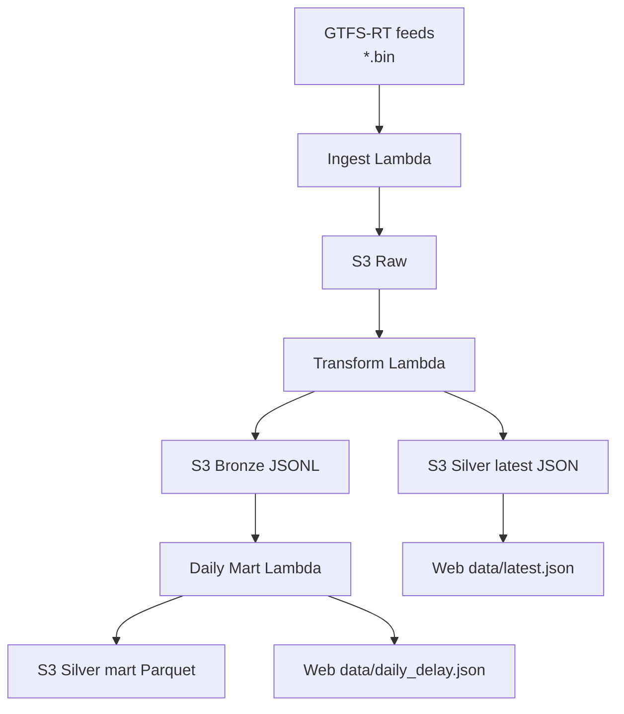

## 全体フロー

## 1. Ingest（収集）

- 役割: 外部フィード取得とRaw保存
- 実装: `infra/lambda/ingest.ts`
- 重要: ここでは変換しない

## 2. Transform（変換）

- 役割: BINデコード、遅延抽出、ステータス化
- 実装: `infra/lambda/transform.ts`
- 出力:
  - Bronze JSONL
  - Silver latest系JSON
  - Web向け最新JSON

## 3. Daily mart（集計）

- 役割: 日次時系列の作成
- 実装: `infra/lambda_py/daily_delay_mart/handler.py`
- 出力:
  - `silver/mart/daily_delay/dt=.../*.parquet`
  - `web/data/daily_delay.json`

## 4. スケジュール

CDKではEventBridgeで10分おき実行（JST 05:00〜23:50）です。

- 参照: `/Users/nakamurashinnosuke/Documents/GitHub/agyancast/infra/lib/agyancast-data-stack.ts`

## 5. この構成にした理由

- 変換ミスしてもRawから再処理できる
- 画面向けと分析向けを分離できる
- 段階的に機能追加しやすい

MVPとしては、複雑性と保守性のバランスが取りやすい構成です。
